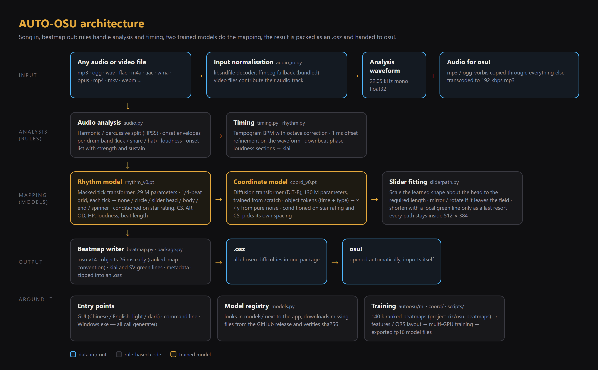
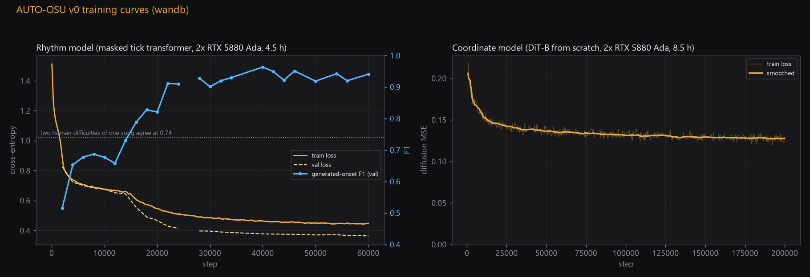

# AUTO-OSU

[](https://github.com/kanze1/AUTO-OSU/releases)
[](https://github.com/kanze1/AUTO-OSU/stargazers)
[](https://github.com/kanze1/AUTO-OSU/actions/workflows/test.yml)
[](LICENSE)

**Drop in a song, get a playable osu!standard beatmap a minute later.**

[中文](README.md) · [Download](https://github.com/kanze1/AUTO-OSU/releases) · [How to use](#how-to-use) · [Quality and limits](#quality-and-limits) · [How it works](#how-it-works) · [FAQ](#faq)


<details>
<summary>Light theme / while generating</summary>


</details>

## Why this exists

I am bad at osu! and I love playing it. The worst part: the songs I want to play have no maps, and I can't map.
So: AUTO-OSU. Drop in the song you like, and a minute later you can play it.

This is v0, and it already makes maps I am happy to play all the way through: the rhythm sits on the drums,
the jumps and streams are learned from over a hundred thousand ranked maps, and all four difficulties come out in one go.
It will keep getting better: mapper intent, deliberate highlights, longer sliders and multiple red lines for tempo changes
are all on the roadmap.

If you are also someone who "just wants to play that one song", take it, open issues, improve it with me.
If it helps you, a ⭐ **star** means a lot. — kanzei

## How to use

### No install (Windows)

1. Download `AUTO-OSU-<version>-win64-cpu.zip` from [Releases](https://github.com/kanze1/AUTO-OSU/releases) (about 550 MB, models included) and unzip it anywhere.
2. Run `AUTO-OSU.exe`.
3. Drag a song onto the window, tick difficulties, click **Generate**.
4. The `.osz` is written to the `output` folder next to the exe and, by default, opened in osu! (it imports itself). Open osu! and it is in the song list.

No GPU needed: a 3-minute song, one difficulty, takes about a minute on a modern CPU (70 s measured on 16 cores; 16 s on an RTX 4090).
Windows 10 / 11, 64-bit.

### Which audio works

Input is normalised before it enters the pipeline, so the format hardly matters:

- audio: mp3, ogg, wav, flac, m4a / aac, wma, opus, aiff, ape, alac …
- video: mp4, mkv, webm, mov, avi … — the audio track is extracted automatically
- the audio packed into the `.osz` is always something osu! can play (mp3 and ogg-vorbis are kept as they are, everything else becomes 192 kbps mp3)

ffmpeg ships with the program; nothing to install.

### The window

| Area | What it does |
| --- | --- |
| Song | Drag and drop, or Browse. |
| Difficulties | Easy / Normal / Hard / Insane, any combination, all packed into one `.osz`. Default Normal + Hard. |
| Output | Target folder; "Import into osu! when done" opens the `.osz`, same as double-clicking it. |
| Models | Shows whether the models are present; one-click download if not (checksums verified). |
| Top right | Chinese / English, light / dark. Settings, last song and folder are remembered. |

**Advanced options** (click "Advanced options"):

| Option | Meaning |
| --- | --- |
| Seed | Another number gives another layout for the same song; the same seed reproduces the same map. |
| BPM / offset | Blank = detected. Fill in by hand when detection is off (tempo changes, near-empty intros). Offset in ms. |
| Creator name | Written into the `.osu` as Creator, default AUTO-OSU. |
| Star rating | Difficulty hint for the models; blank = per-difficulty default: Easy 2.0 / Normal 3.2 / Hard 4.5 / Insane 5.5. Raise it for a denser Hard. |
| Placement quality | Diffusion steps of the coordinate model: fast 50 / standard 100 / fine 200. Standard is plenty. |
| Device | auto prefers a CUDA GPU, otherwise CPU. |
| Engine | "AI models" is the normal mode; "rules only" needs no models and maps in seconds — for comparison or when models are missing. |
| Preview mp3 | Also saves an mp3 with the song turned down and a click on every object, to check the rhythm without opening osu!. |

### Command line

`python -m autoosu SONG [options]`; the exe accepts the same arguments (`AUTO-OSU.exe song.mp3 -d Hard`).

| Option | Meaning |
| --- | --- |
| `-d Easy Normal Hard Insane` | difficulties to generate |
| `-o DIR` | output folder, default `out` |
| `--seed N` | random seed |
| `--bpm` / `--offset` | manual BPM / red-line offset (ms) |
| `--title` / `--artist` / `--creator` | override metadata (default: audio tags, or an "Artist - Title" file name) |
| `--star X` | star-rating condition |
| `--coord-steps N` | diffusion steps, default 100 |
| `--cfg-scale X` | classifier-free guidance of the coordinate model, default 1.0 |
| `--temperature` / `--density` / `--density-bias` / `--decode-steps` | rhythm-model sampling: temperature, target objects per measure, "no note" bias (negative = denser), decoding rounds |
| `--device auto\|cuda\|cpu` | compute device |
| `--rules` | rule-based mode |
| `--rhythm-model` / `--coord-model` | explicit model files; otherwise looked up in `models/` |
| `--no-coord-model` | rhythm model only, rule-based placement |
| `--download` | fetch missing models from the GitHub release |
| `--osu-shift 26` | how many ms early objects are written into the `.osu` |
| `--preview` | also write the preview mp3 |
| `--debug-plot` | save an analysis image: loudness and kiai sections, onsets and beat grid, chosen notes per difficulty |
| `--dump-events` | print every object with time, type and beat |

### Python install

```bash
git clone https://github.com/kanze1/AUTO-OSU
cd AUTO-OSU
python -m venv .venv && .venv\Scripts\activate       # Windows; Linux/macOS: source .venv/bin/activate
pip install -e .[gui]
# NVIDIA GPU (optional): pip install torch --index-url https://download.pytorch.org/whl/cu130
python -m autoosu --download                          # fetch the models once (~320 MB)
python -m autoosu                                     # open the window
python -m autoosu "song.mp3" -d Normal Hard -o out    # command line
```

Python 3.10 or newer. This is also how to run it on macOS / Linux; the exe is Windows only.

## Quality and limits

- **The rhythm sits on the drums.** On the validation set the rhythm model reaches an onset F1 of 0.96 against the human map; two human difficulties of the same song agree at only 0.74.
- **Placement looks human.** The coordinate model generates coordinates from pure noise; jumps, streams and slider shapes are learned. Every slider is fitted so it stays on screen.
- **What is still missing.** One red line per song; slider length is not a model input yet, so long sliders on fast songs are occasionally shortened (a green line keeps the timing right);
  hitsounds are simple drum-based whistle / clap / finish; no background or storyboard. Check the map in the editor before submitting it anywhere.

## How it works



**Analysis and timing (rules).** Harmonic / percussive split, onset envelopes per drum band (kick / snare / hat); tempogram BPM with octave correction;
1 ms offset refinement on the waveform; downbeats from kicks, chord changes and loudness; loudness sections → kiai.
Objects are written 26 ms before the audio transient, the convention of ranked maps that players calibrate their offset against.

**Rhythm model** `rhythm_v0.pt`, about 29 M parameters. A bidirectional transformer on a 1/4-beat grid: each tick sees ±80 ms of mel spectrogram,
its position in the bar, local loudness, plus the requested star rating / CS / AR / OD / HP, and predicts one of six classes
(none / circle / slider head / body / end / spinner), decoded MaskGIT-style in 12 parallel rounds.

**Coordinate model** `coord_v0.pt`, about 130 M parameters. The DiT-B architecture from [osu-diffusion](https://github.com/OliBomby/osu-diffusion),
trained from scratch here on the full 1000-step noise schedule. Input is the object token sequence (circles, slider heads, anchors, slider ends, spinners, each with its time);
it denoises x / y for every point from pure noise. The only conditions are star rating and CS; half of the training samples had the "distance to the previous point" zeroed, so it chooses its own spacing.

**Slider fitting.** The model draws the shape, the rhythm dictates the length: each slider is scaled about its head to the required length; if it would leave the field it is mirrored, then rotated,
and only as a last resort shortened with a local green line. Fast songs get a lower SliderMultiplier.

### Training record



| Model | Data | Hardware | Steps | Wall time | Result |
| --- | --- | --- | --- | --- | --- |
| Rhythm, masked v0 | 139,582 osu!standard beatmaps ([project-riz/osu-beatmaps](https://huggingface.co/datasets/project-riz/osu-beatmaps)) | 2 × RTX 5880 Ada | 60k, batch 128 | 4.5 h | step 40k used: generated-onset F1 0.963, density error 0.10 |
| Coordinates, DiT-B v0 | 140,018 maps of the same corpus (ORS layout) | 2 × RTX 5880 Ada | 200k, batch 128 | 8.5 h | final loss 0.125; 0 % out of bounds; layouts at 50k / 100k / 200k nearly identical for one seed |

An autoregressive rhythm model was trained too; causal attention could not hear the upcoming audio and it liked to hide behind spinners, so the masked version won.
The full log, failed routes included, is in [docs/rhythm_model_design.md](docs/rhythm_model_design.md) (Chinese);
wandb projects: [autoosu-rhythm](https://wandb.ai/kanzei/autoosu-rhythm), [autoosu-coords](https://wandb.ai/kanzei/autoosu-coords).

## Train it yourself / build the exe

Everything used for training is in the repo: `autoosu/ml/prepare_data.py` (HF shards → features and labels), `autoosu/ml/train.py` (rhythm model, `torchrun` multi-GPU),
`coord/` + `scripts/coord_make_ors.py` (coordinate model, accelerate), `scripts/server_*.sh` (server workflow), `scripts/coord_export.py` (export to release files).
Both model files load with `torch.load(weights_only=True)`, no pickled code.

Building the exe:

```powershell
pip install -e .[build]
powershell -ExecutionPolicy Bypass -File scripts/build_exe.ps1            # dist/AUTO-OSU-<version>-win64-cpu.zip
```

A venv with a CUDA torch plus `-Venv .venv-gpu -Suffix cuda` gives the GPU build. `python scripts/make_icon.py avatar.png` creates the window avatar and exe icon.

## FAQ

**Model download fails?** Download `rhythm_v0.pt` and `coord_v0.pt` from [models-v0](https://github.com/kanze1/AUTO-OSU/releases/tag/models-v0) by hand
and put them into the `models/` folder next to the exe (or `~/.autoosu/models/`).

**Antivirus complains?** PyInstaller bundles are often flagged. Run it the Python way, or build it yourself with the steps above.

**BPM or offset wrong?** Set them in Advanced options. Songs with tempo changes currently get a single red line.

**osu! did not open?** `.osz` is not associated with osu! on your system; drag the generated `.osz` onto the osu! window.

**Too slow?** About a minute per difficulty on CPU is normal; "fast" placement quality halves it; with an NVIDIA GPU install the CUDA torch via the Python route.

**A format will not decode?** Make sure the file plays at all; the program tries libsndfile, then the bundled ffmpeg, and reports the exact reason if both fail.

## Roadmap

- Coordinate model v1: required slider length as a per-point condition, ending shortened long sliders for good.
- Rhythm model: mapper-style condition, 1/12 grid for triplets.
- Several seeds per song to pick from; a GPU zip; multiple red lines for tempo changes.

## Licence and attribution

Code and models are released under **MIT plus an attribution condition** (see [LICENSE](LICENSE)):

- Personal use, learning, playing around in the community: keep the copyright notice, exactly like plain MIT.
- **Commercial use or large-scale deployment** (a public web service, an app distributed to the general public, bulk generation for a platform or community):
  show **AUTO-OSU by kanzei** with a link to this repository, https://github.com/kanze1/AUTO-OSU, prominently in the product's interface, about page, store page or documentation.

Generated beatmaps are yours; the songs belong to their artists.

## Acknowledgements

- [osu-diffusion](https://github.com/OliBomby/osu-diffusion) (MIT) — DiT architecture and diffusion code, vendored in `autoosu/ml/coord`.
- [Mapperatorinator](https://github.com/OliBomby/Mapperatorinator) (MIT) — tokenisation ideas and the baseline we compared against.
- [project-riz/osu-beatmaps](https://huggingface.co/datasets/project-riz/osu-beatmaps) — the training corpus.
- [osu-dreamer](https://github.com/jaswon/osu-dreamer) — an earlier baseline.
- [Noto Sans SC](https://fonts.google.com/noto/specimen/Noto+Sans+SC) (OFL) — the interface font, bundled as AUTO-OSU Sans.

Author: kanzei
