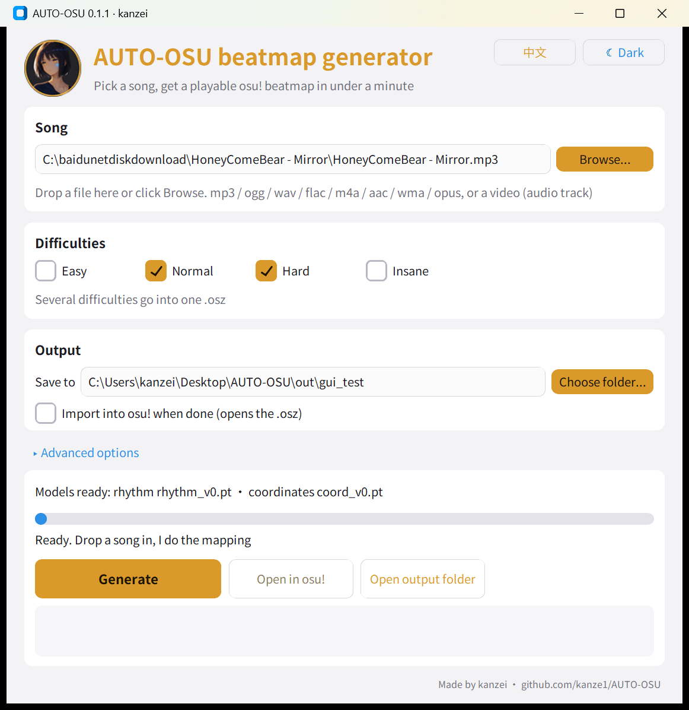
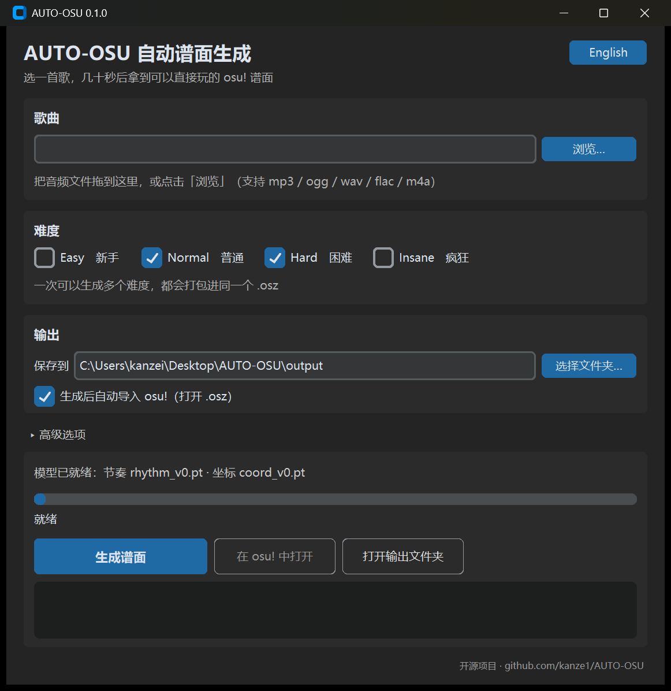
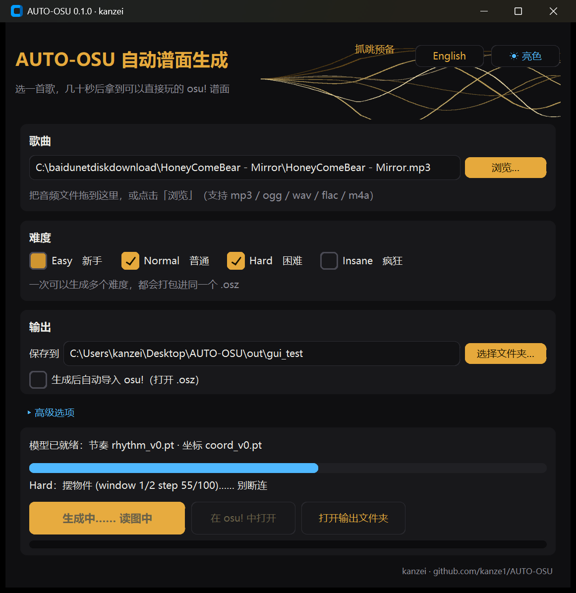

# AUTO-OSU

**Turn any song into a playable osu!standard beatmap.** Drop in an mp3, tick the difficulties you
want, press *Generate*, and an `.osz` opens in osu! a minute later.

[中文说明](README.md) · [Download](https://github.com/kanze1/AUTO-OSU/releases) · [How it works](#how-it-works)



<details><summary>Dark theme / Chinese, and the header while generating</summary>





</details>

## Download and run (Windows, no install)

1. Grab `AUTO-OSU-<version>-win64-cpu.zip` from the [releases page](https://github.com/kanze1/AUTO-OSU/releases) and unzip it anywhere.
2. Run `AUTO-OSU.exe`.
3. Drag a song onto the window (mp3 / ogg / wav / flac / m4a), tick **Normal** / **Hard** / …, click **Generate**.
4. The `.osz` is written to the `output` folder next to the exe and, by default, opened in osu! straight away.

The zip already contains the two trained models (~320 MB). If they are missing, the window offers a
one-click download. A GPU is not required: a 3-minute song takes about a minute on a modern CPU
and about 15 s on an NVIDIA GPU (use the `-cuda` zip or the Python install for GPU support).

The interface is in Chinese or English and has light and dark looks (buttons in the top right); it follows your system language and theme.

## Python install

```bash
git clone https://github.com/kanze1/AUTO-OSU
cd AUTO-OSU
python -m venv .venv && .venv\Scripts\activate       # Windows
pip install -e .[gui]
# GPU (optional): pip install torch --index-url https://download.pytorch.org/whl/cu130
python -m autoosu --download                          # fetch the models once (~320 MB)
python -m autoosu                                     # opens the window
python -m autoosu "song.mp3" -d Normal Hard -o out    # command line
```

Useful command-line options:

| Option | Meaning |
| --- | --- |
| `-d Easy Normal Hard Insane` | difficulties to generate (all go into one `.osz`) |
| `--seed N` | another seed = another layout for the same song |
| `--bpm` / `--offset` | override the detected BPM / red line offset (ms) |
| `--star X` | star rating the models are conditioned on (default per difficulty: 2.0 / 3.2 / 4.5 / 5.5) |
| `--coord-steps 50` | fewer diffusion steps = faster placement (default 100) |
| `--device cpu` | force CPU |
| `--rules` | rule-based generator only, no models (fast, basic quality) |
| `--preview` | also write an mp3 with click sounds on every object, to check the rhythm by ear |

## How it works

```
song ──► audio analysis ──► timing ──► rhythm model ──► coordinate model ──► slider fitting ──► .osz
         (librosa: HPSS,     BPM +      *when* to hit    *where* to hit      keep every slider
          onsets, loudness)  offset,    (tick transformer) (diffusion DiT)    on screen
                             kiai
```

* **Audio analysis + timing** (rule based): percussive/harmonic split, onset envelopes per drum band,
  tempogram BPM with octave correction, 1 ms offset refinement on the waveform, downbeat phase,
  loudness sections → kiai. Objects are written 26 ms early, the osu! ranked-map convention.
* **Rhythm model** — `rhythm_v0.pt`, 29 M parameters. A bidirectional transformer over a 1/4-beat
  grid; every tick gets a class (nothing / circle / slider head / slider body / slider end / spinner)
  from ±80 ms of mel spectrogram, its metrical position, loudness and the requested star rating /
  CS / AR / OD / HP. Decoded MaskGIT-style in 12 parallel rounds. Trained on ~140 k ranked
  osu!standard beatmaps; onset F1 against the human map 0.96 (two human difficulties of the same
  song agree at ~0.74).
* **Coordinate model** — `coord_v0.pt`, 130 M parameters (DiT-B, architecture from
  [osu-diffusion](https://github.com/OliBomby/osu-diffusion), trained from scratch here on the full
  1000-step schedule). Given the token sequence (circles, slider heads, anchors, ends, spinners with
  their times) it denoises x/y positions from pure noise, conditioned on star rating and circle
  size. 100 sampling steps by default.
* **Slider fitting**: the model draws the *shape* of a slider; its length is dictated by the
  rhythm. Each slider is scaled about its head to the required length, and if the path would leave
  the 512×384 field the shape is mirrored / rotated, or as a last resort shortened with a local
  slider-velocity change. Every generated map is checked to stay on screen.

Design notes, experiments and results: [docs/rhythm_model_design.md](docs/rhythm_model_design.md),
[docs/mapperatorinator_tech.md](docs/mapperatorinator_tech.md).

## The header animation (for the curious)

The gold pulse waves are drawn with PIL at 2x vertical resolution and box-reduced (anti-aliased),
paced by a background thread to the display refresh rate (240 Hz works; Tk's own `after()` timer
would burn a quarter of a core spinning at that rate). While idle the app plays a pre-rendered
seamless loop whose unique frame rate adapts to a 64 MB memory budget (~96 fps on a 1440p/150 %
display) at ~7 % of one core; while generating, frames are rendered live so the crest can follow
the progress (~1.4 ms per frame). *Advanced options* has a switch to freeze it on weak machines.

## Training your own models

Everything used to train the released models is in the repo:

* `autoosu/ml/prepare_data.py` — HuggingFace `project-riz/osu-beatmaps` shards → log-mel + tick labels
* `autoosu/ml/train.py` — rhythm model (DDP via `torchrun`, `--mode masked`, wandb logging)
* `coord/` + `scripts/coord_make_ors.py` — coordinate model (accelerate, config `coord/configs/diffusion/coord_v0.yaml`)
* `scripts/server_*.sh` — the exact server workflow (bootstrap, data prep, training)
* `scripts/coord_export.py` / `autoosu.ml.coord_infer.export_coord_model` — checkpoint → release file

Both models load with `torch.load(weights_only=True)` (no pickled code).

## Building the exe

```powershell
pip install -e .[build]
powershell -ExecutionPolicy Bypass -File scripts/build_exe.ps1            # dist/AUTO-OSU-<version>-win64-cpu.zip
```

Use a venv with a CUDA torch and `-Venv .venv-gpu -Suffix cuda` for the GPU build.

## Limitations (v0)

* One BPM per song: songs with tempo changes get one red line; use `--bpm/--offset` for odd cases.
* Slider *shapes* are learned but slider *lengths* are not yet a model input, so very long sliders
  on fast songs occasionally get shortened (a green line keeps the timing correct).
* No hitsound modelling beyond simple drum-based whistles/claps/finishes; no storyboard/background.
* Timing is detected, not human-verified: check the offset in the editor before ranking anything.

## Acknowledgements

* [osu-diffusion](https://github.com/OliBomby/osu-diffusion) (MIT) — DiT architecture and diffusion code, vendored in `autoosu/ml/coord`.
* [Mapperatorinator](https://github.com/OliBomby/Mapperatorinator) (MIT) — the tokenisation ideas and the baseline we compared against.
* [project-riz/osu-beatmaps](https://huggingface.co/datasets/project-riz/osu-beatmaps) — the training corpus.
* [osu-dreamer](https://github.com/jaswon/osu-dreamer) — an earlier baseline.

## License

MIT — see [LICENSE](LICENSE). Generated beatmaps belong to you; the songs belong to their artists.
